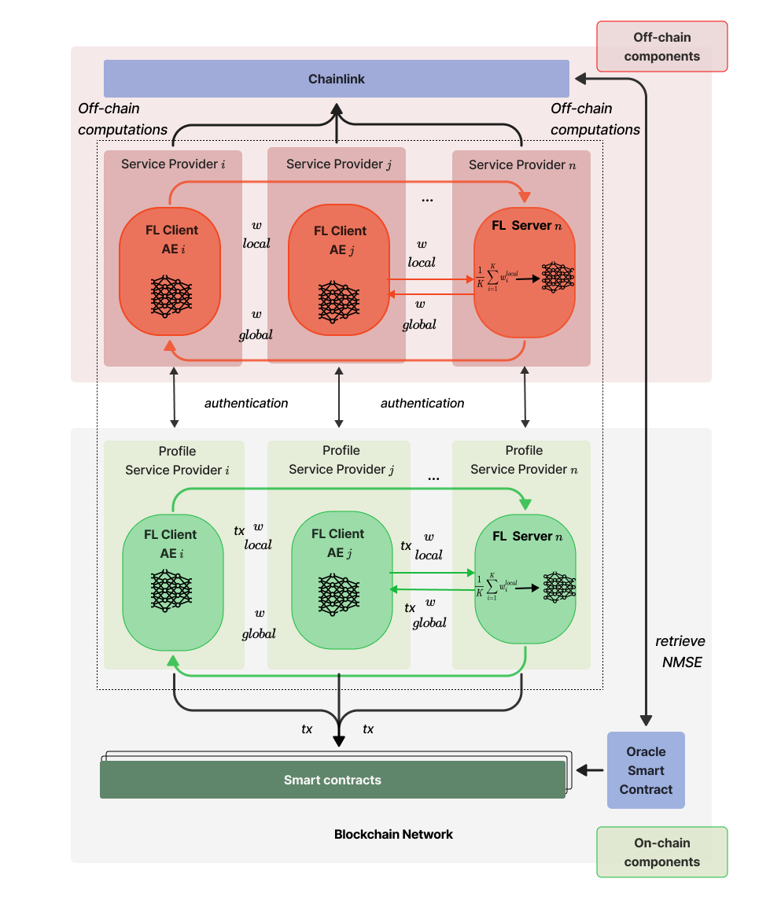

# Trustworthy Reputation for Federated Learning in O-RAN Leveraging Blockchain and Smart Contracts

## Abstract

This paper proposes a framework to enhance the collaborative infrastructure of O-RAN by integrating blockchain technology with Federated Learning (FL). Traditional frameworks struggle with transparency and trust, especially in multi-vendor environments. Our solution transitions from implicit trust—where assurance is assumed—to explicit trust, established through verifiable mechanisms. We address challenges in interoperability and accuracy of client contributions using a blockchain-based reputation system. This system supports the FL model, enabling collaborative, privacy-preserving training of machine learning models. Reputation scores are calculated on-chain based on the accuracy and integrity of client contributions, thereby enhancing data reliability and promoting accountability. Smart contracts automate the recording and verification of these contributions, ensuring that data inputs directly influence reputation in a transparent and tamper-proof manner. Implemented on the Layer 2 Polygon testnet, the framework benefits from efficient transaction handling and scalability. It broadens potential applications of blockchain and FL in creating trustworthy collaborative systems and addresses challenges of reputation alignment and transparency in traditional environments. The implementation of this research is publicly accessible through this repository.

---



## Overview of Smart Contracts

### Smart Contracts Involved

1. **CalculateReputation.sol** - Manages the reputation system, calculating and updating reputation scores based on the normalized mean square error of contributions from federated learning clients.
2. **ClientRegistration.sol** - Handles the registration of clients to the federated learning framework. It ensures that only authorized clients can submit data and participate in the learning process.
3. **WeightSubmission.sol** - Facilitates the submission of model weights by clients. It verifies the authenticity and correctness of submissions, maintaining a record on the blockchain.

## Installation and Running Instructions Using Hardhat

### Prerequisites

- Node.js installed (version 14.x or later)
- A personal Ethereum wallet (e.g., MetaMask)

### Setup

1. **Clone the repository:**
   ```
   git clone <repository-url>
   cd <repository-directory>
   ```

2. **Install dependencies:**
   ```
   npm install
   ```

3. **Create a `.env` file:**
   Add your Ethereum wallet private key and Alchemy/Polygon node URL:
   ```
   PRIVATE_KEY="your-wallet-private-key"
   POLYGON_URL="https://polygon-mumbai.g.alchemy.com/v2/your-api-key"
   ```

### Common Hardhat Commands

- **Compile contracts:**
  ```
  npx hardhat compile
  ```
  This compiles the smart contracts and checks for any syntax errors.

- **Run tests:**
  ```
  npx hardhat test
  ```
  Execute unit tests for the contracts to ensure correct behavior.

- **Deploy contracts:**
  ```
  npx hardhat run scripts/deploy.js --network polygon_mumbai
  ```
  Deploys the smart contracts to the Polygon Mumbai testnet.

- **Interact with deployed contracts:**
  ```
  npx hardhat console --network polygon_mumbai
  ```
  Provides an interactive console to interact with deployed contracts.

- **Verify contract on Etherscan:**
  ```
  npx hardhat verify --network polygon_mumbai DEPLOYED_CONTRACT_ADDRESS
  ```
  Verifies the source code of your deployed contract on the Polygon Etherscan, which is useful for transparency and trust.

### Deployment via Hardhat Ignition

If you want to use Hardhat Ignition for deployment:
```
npx hardhat ignition deploy ./ignition/modules/Lock.js
```
This command deploys modules using Hardhat Ignition, a plugin for advanced deployment scripts.

## Conclusion

This setup not only improves the robustness and efficiency of the O-RAN ecosystem but also enhances data security and user privacy through decentralized technologies. The integration of blockchain allows for a tamper-proof, transparent record-keeping system that significantly boosts the trustworthiness of the federated learning process within telecom networks.
